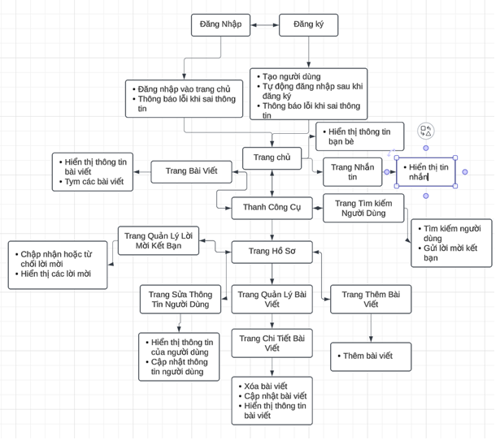
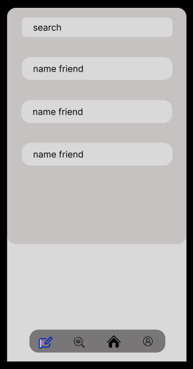
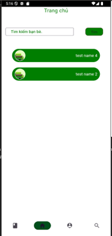

## XÂY DỰNG ỨNG DỤNG MẠNG XÃ HỘI BẰNG THƯ VIỆN FLUTTER

### Thành viên thực hiện 
- Nguyễn Lê Quốc Bảo - tham gia đóng góp 80% (bản thân).
- Lâm Đạo Bình An - tham gia đóng góp 5%.
- Lưu Hoàng Bảo Duy - tham gia đóng góp 5%.
- Lê Nguyễn Hoài An - tham gia đóng góp 5%.
- Phan Triệu Tỷ - tham gia đóng góp 5%.

### Lời mở đầu 
- Trong bối cảnh công nghệ thông tin ngày càng phát triển mạnh mẽ, việc kết nối và giao tiếp trở thành yếu tố không thể thiếu trong cuộc sống hàng ngày của con người. Ứng dụng nhắn tin tức thời (chat app) đã và đang đóng vai trò quan trọng trong việc rút ngắn khoảng cách, giúp mọi người kết nối dễ dàng hơn dù ở bất kỳ nơi đâu trên thế giới.
- Dự án xây dựng ứng dụng chat này ra đời với mục tiêu cung cấp một giải pháp giao tiếp hiện đại, hiệu quả và dễ sử dụng. Ứng dụng không chỉ hỗ trợ người dùng gửi tin nhắn văn bản, hình ảnh và âm thanh một cách nhanh chóng mà còn đảm bảo tính bảo mật cao và trải nghiệm người dùng tối ưu.

### Thự viện và ngôn ngữ sử dụng trong dự án
- flutter (thư viện cho giao diện - frontend)
- Dart (ngôn ngữ cho thư viện flutter)
- Spring boot (thư viện cho cơ sở dữ liệu - backend)
- Java (ngôn ngữ cho thư viện Spring boot)

### Các công cụ sử dụng trong dự án
- IDE (Vscode - frontend, Intelij - backend)
- Postman (Test api)
- SQL Server Management Studio 20 (sql server 2019)
- Figma (Thiết kế giao diện)

### Sơ đồ chức năng và url app

### Giao diện phát thảo và giao diện thực tế của app
- Giao diện phát thảo trên figma

- Giao diện thực tế

### Tài liệu
[Báo cáo chi tiết dự án](report/chat_app_chuyen_de_chuyen_sau_1_nguyen_le_quoc_bao_2100004053.docx)

